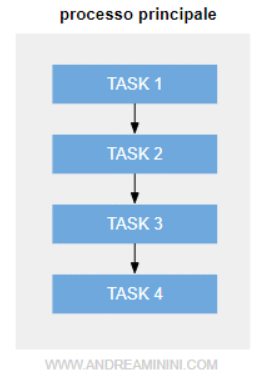
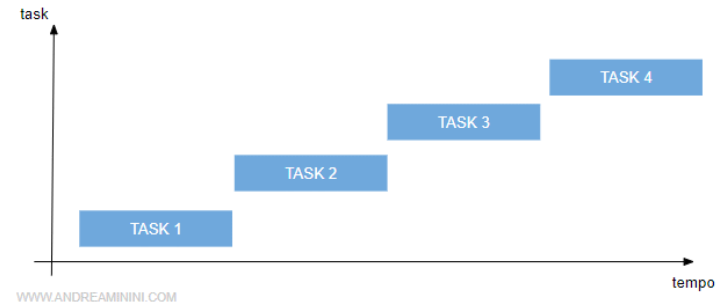
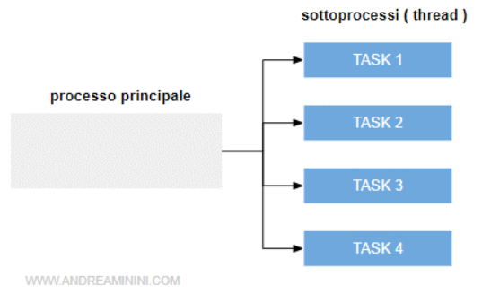
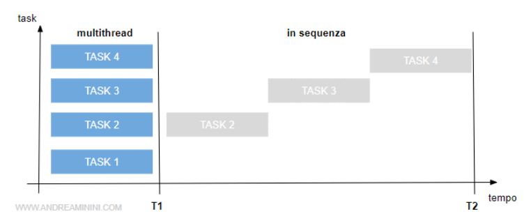

# programmazione_multithreading
Questo repository contiene esercizi relativi alla programmazione multithreading affrontati durante il corso di Sistemi Operativi 2020-2021

# Definizioni
Programmazione multithreading - è un paradigma che permette di eseguire più sottoprocessi in parallelo. E' detta anche programmazione concorrente.

Thread - è un sottoprocesso lanciato da un processo principale. L'esecuzione del thread è indipendente dal processo "padre" che l'ha lanciato. 

# Programma tradizionale vs Multithread

## Programma tradizionale

## Multithread

src: https://www.andreaminini.com/informatica/programmazione/programmazione-multithreading